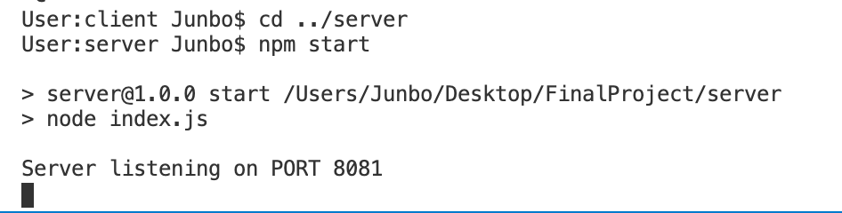
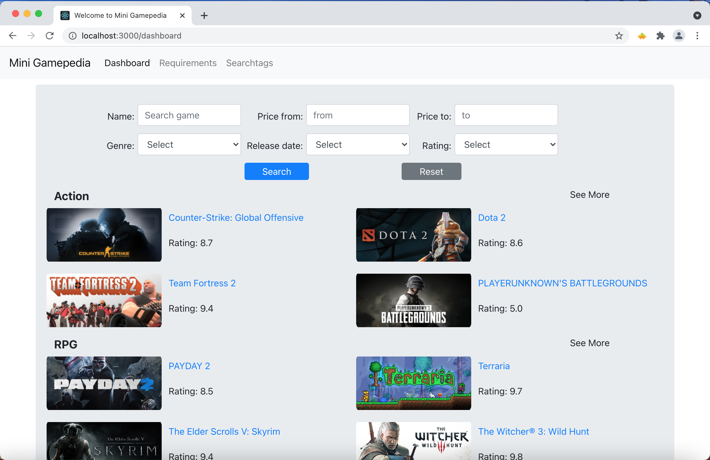

# Front end:
## 1. install modules.
```
cd client
npm install
```
## 2. start project
```
cd client
npm run start
```

# Backend:
## 1. install modules.
```
cd server
npm install
```
## 2. start project
```
cd server
npm start
```



## Then you should see the following page in your browser:
 


